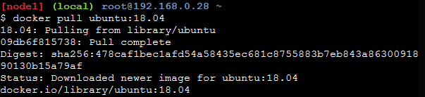
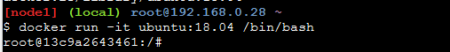
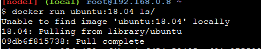
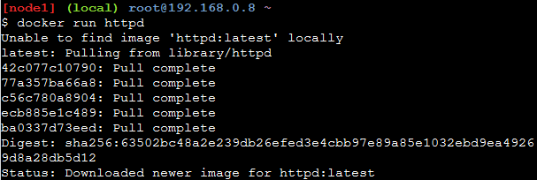
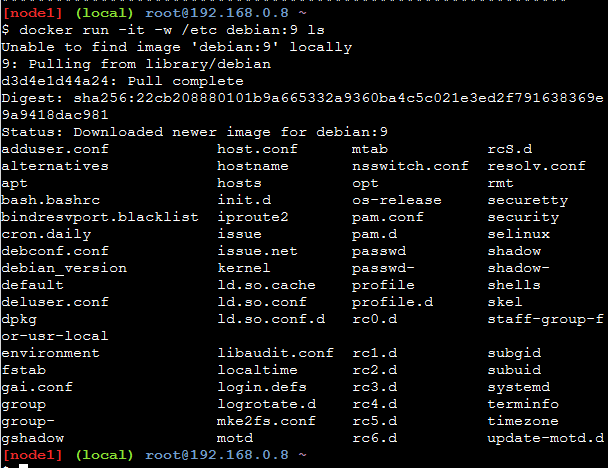
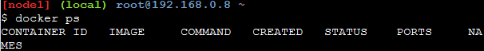
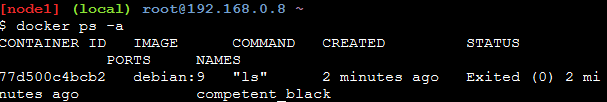

# Examen_JosepLluisSastre
## Apartado 1

### Ejemplo 1

##### Paso 1: Descargamos una imagen antes de empezar.

##### Paso 2: Creamos un contenedor de ubuntu:18.04 y asi tener acceso a un shell en el.

### Ejemplo 2

##### Paso 1: Creamos un contenedor de centOs:18.04 y listar el contenido de la carpeta.

### Ejemplo 3

#####Paso 1: Creamos un contenedor httpd o tambien conocido como servidor apache.

### Ejemplo 4

##### Paso 1: Creamos un contenedor de debian 9 y mostramos el contenido de una carpeta establecida con el parametro -w.

##### Paso 2: Mostramos los contenedores en ejecución

##### Paso 3: Mostramos todods los contenedores creados ya esten en ejecucion o parados.

